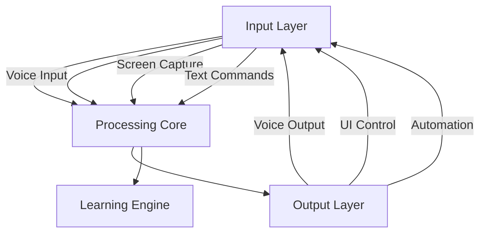

# NeoMate AI 🤖

[](https://opensource.org/licenses/MIT)
[](https://www.python.org/downloads/)
[]()
[]()
[](https://github.com/emonhmamun/NeoMate-AI/stargazers)
[](https://github.com/emonhmamun/NeoMate-AI/network/members)

> _Revolutionizing human-computer interaction with autonomous AI intelligence_

## 📖 Table of Contents

- [🌟 Overview](#-overview)
- [🚀 Key Features](#-key-features)
- [🎯 How It Works](#-how-it-works)
- [🛠️ Technology Stack](#️-technology-stack)
- [📋 Getting Started](#-getting-started)
- [🎮 Usage Examples](#-usage-examples)
- [🤝 Contributing](#-contributing)
- [📄 License](#-license)
- [📞 Support & Community](#-support--community)
- [🙏 Acknowledgments](#-acknowledgments)
- [🗺️ Roadmap](#️-roadmap)

## 🌟 Overview

NeoMate AI is a groundbreaking, open-source autonomous AI assistant that transcends traditional voice assistants. Built with state-of-the-art AI technologies, NeoMate provides real-time, multi-language support with human-like intelligence, enabling seamless multitasking and natural conversation. Our mission is to create an AI companion that understands context, learns continuously, and executes complex tasks with precision, all while maintaining the highest standards of privacy and security.

### 🎯 Vision

To empower every individual with a personal AI assistant that enhances productivity, creativity, and daily life through intelligent automation and natural interaction.

### 💡 Philosophy

- **Privacy-First**: Your data stays on your device
- **Open-Source**: Transparent, community-driven development
- **Accessible**: Works offline, no subscriptions required
- **Extensible**: Modular architecture for endless possibilities

## 🚀 Key Features

### 🧠 Core Intelligence

- **Advanced Reasoning**: Multi-step task planning and execution
- **Contextual Understanding**: Remembers conversations and preferences
- **Emotional Intelligence**: Adapts tone based on user mood and context
- **Continuous Learning**: Improves performance over time

### 👁️ Computer Vision & Interaction

- **Real-time Screen Analysis**: OCR, object detection, and visual understanding
- **Peripheral Control**: Direct keyboard and mouse automation
- **Visual Task Execution**: Can "see" and interact with applications
- **Screenshot Intelligence**: Analyzes and acts on visual content

### 🗣️ Natural Language Processing

- **Multi-Language Support**: Fluent in English and Bengali
- **Conversational AI**: Natural, human-like dialogue
- **Voice Recognition**: Wake word detection and continuous listening
- **Text-to-Speech**: High-quality voice synthesis with emotional expression

### ⚡ Performance & Reliability

- **Asynchronous Multitasking**: Handle multiple tasks simultaneously
- **Low Resource Usage**: Optimized for everyday computers
- **Offline Operation**: No internet required for core functionality
- **Auto-Recovery**: Graceful handling of errors and interruptions

### 🔒 Security & Privacy

- **End-to-End Encryption**: All data encrypted locally
- **No Data Collection**: Nothing sent to external servers
- **Local Processing**: AI models run on your device
- **Configurable Permissions**: Control what the AI can access

### 🔌 Extensibility

- **Universal LLM Support**: Compatible with Ollama, OpenRouter, OpenAI, Groq
- **Plugin Architecture**: Easy to add new capabilities
- **API Integration**: Connect with external services securely
- **Custom Commands**: Teach NeoMate new skills

## 🎯 How It Works

NeoMate AI operates through a sophisticated multi-layered architecture:

1. **Input Processing**: Voice, text, and visual inputs are captured and processed
2. **Context Analysis**: Current state, user history, and environmental factors are considered
3. **Decision Making**: Advanced algorithms determine the best course of action
4. **Task Execution**: Commands are executed through various output channels
5. **Learning Loop**: Performance is analyzed and improvements are made

### Architecture Overview



## 🛠️ Technology Stack

NeoMate AI's architecture is built on a hierarchical, tiered system designed for modularity, performance, and extensibility. Below is the comprehensive toolkit organized from foundational to advanced layers:

### **🏗️ Tier 0: The Foundation (ভিত্তি - Core Essentials)**

These are the core components that form NeoMate's nervous system and multitasking engine.

| #   | Library                 | Purpose                                                         | Alternatives    |
| --- | ----------------------- | --------------------------------------------------------------- | --------------- |
| 1   | **`asyncio`**           | Asynchronous core for multi-tasking and non-blocking operations | `Trio`, `AnyIO` |
| 2   | **`PyQt6` / `PySide6`** | UI framework for interactive, animated interfaces               | `Tauri`, `Flet` |

### **👁️ Tier 1: The Senses (ইন্দ্রিয় - Input Processing)**

Libraries that enable NeoMate to perceive and process environmental data.

| #   | Library             | Purpose                               | Alternatives                        |
| --- | ------------------- | ------------------------------------- | ----------------------------------- |
| 3   | **`pvporcupine`**   | Wake word detection for "Hey NeoMate" | `Picovoice Leopard`                 |
| 4   | **`Whisper.cpp`**   | Speech-to-text conversion, offline    | `Vosk-API`, `sounddevice`/`pyaudio` |
| 5   | **`mss`**           | Real-time screen capture              | `Pillow`, `pyautogui`               |
| 6   | **`OpenCV-Python`** | Computer vision for object detection  | `Pillow-SIMD`                       |
| 7   | **`Tesseract`**     | Optical Character Recognition         | `EasyOCR`, `Keras-OCR`              |

### **🧠 Tier 2: The Brain (মস্তিষ্ক - Intelligence & Decision Making)**

Flexible AI components configurable based on user preferences.

| #   | Library                 | Purpose                                                          | Alternatives                  |
| --- | ----------------------- | ---------------------------------------------------------------- | ----------------------------- |
| 8   | **`Ollama`**            | Local LLM runner (Llama 3, Mistral, etc.)                        | `LM Studio`, `Llama.cpp`      |
| 9   | **`HTTPX`**             | Async HTTP client for API calls (OpenRouter, OpenAI, Groq, etc.) | `aiohttp`, `requests`         |
| 10  | **`duckduckgo_search`** | Privacy-friendly web search                                      | `Brave Search API`, `SearXNG` |

### **🤖 Tier 3: The Hands (হাত - Action Execution)**

Tools that translate decisions into real-world actions.

| #   | Library                       | Purpose                       | Alternatives              |
| --- | ----------------------------- | ----------------------------- | ------------------------- |
| 11  | **`pyautogui`**               | Mouse and keyboard automation | `pydirectinput`, `pynput` |
| 12  | **`pyperclip`**               | Clipboard management          | -                         |
| 13  | **`Selenium` / `Playwright`** | Advanced web automation       | -                         |

### **💭 Tier 4: The Soul & Memory (আত্মা ও স্মৃতি - Personality & Knowledge)**

Components for long-term learning and unique identity.

| #   | Library            | Purpose                                    | Alternatives           |
| --- | ------------------ | ------------------------------------------ | ---------------------- |
| 14  | **`Piper TTS`**    | Text-to-speech with natural voices         | `Coqui TTS`, `pyttsx3` |
| 15  | **`SQLite3`**      | Local database for preferences and history | `TinyDB`               |
| 16  | **`cryptography`** | Encryption for sensitive data              | -                      |

### **🔧 Tier 5: Utilities (সহায়ক টুলস - Supporting Infrastructure)**

Essential helpers that tie everything together.

| #   | Library             | Purpose                      | Alternatives |
| --- | ------------------- | ---------------------------- | ------------ |
| 17  | **`python-dotenv`** | Configuration management     | -            |
| 18  | **`psutil`**        | System resource monitoring   | -            |
| 19  | **`shutil`**        | File system operations       | -            |
| 20  | **`watchdog`**      | File system change detection | -            |

## 📋 Getting Started

### Prerequisites

- **Operating System**: Windows 10/11, macOS 10.15+, or Linux Ubuntu 18.04+
- **Python**: Version 3.10 or higher - [Download here](https://www.python.org/downloads/)
- **Git**: Version control system - [Download here](https://git-scm.com/downloads)
- **RAM**: Minimum 8GB (16GB recommended for optimal performance)
- **Storage**: 5GB free space for models and data
- **Microphone**: For voice input (optional but recommended)
- **Speakers/Headphones**: For voice output (optional)

### Installation

#### Using pip (Recommended)

```bash
git clone https://github.com/emonhmamun/NeoMate-AI.git
cd NeoMate-AI
python -m venv neomate_env
# On Windows:
neomate_env\Scripts\activate
# On macOS/Linux:
source neomate_env/bin/activate
pip install -r requirements.txt
```

#### Using Conda (Alternative)

If you prefer Conda for managing environments, especially for system-level dependencies:

```bash
git clone https://github.com/emonhmamun/NeoMate-AI.git
cd NeoMate-AI
conda env create -f environment.yml
conda activate neomate-ai-env
```

### Configuration

Copy the example config and edit as needed:

```bash
cp config/settings.yaml.example config/settings.yaml
```

Edit `config/settings.yaml` to customize language, voice, API keys, privacy, and more.

### Running NeoMate AI

```bash
python src/main.py
```

## 🎮 Usage Examples

- **Basic Interaction**: "Hey NeoMate, what's the weather today?"
- **Complex Tasks**: "Help me prepare for my presentation tomorrow."
- **Multi-language Support**: "আমার কাজের লিস্ট দেখাও" (Show my task list)
- **Automation**: "Organize my downloads folder by file type."

## 🤝 Contributing

We welcome contributions! Please see [CONTRIBUTING.md](docs/contributing.md) for guidelines.

### Development Workflow

```bash
git clone https://github.com/emonhmamun/NeoMate-AI.git
cd NeoMate-AI
python -m venv dev_env
# Activate environment
# Windows:
dev_env\Scripts\activate
# macOS/Linux:
source dev_env/bin/activate
pip install -r requirements-dev.txt
pre-commit install
```

Create a feature branch, make changes, run tests, and submit a pull request.

## 📄 License

This project is licensed under the MIT License - see the [LICENSE.md](LICENSE.md) file for details.

## 📞 Support & Community

- **Documentation**: [docs/](docs/)
- **Discussions**: [GitHub Discussions](https://github.com/emonhmamun)
- **Email**: ehm.businessbd@gmail.com

## 🙏 Acknowledgments

- Open-source AI community
- Contributors and beta testers
- Research institutions and academic partners

## 🗺️ Roadmap

- **Phase 1**: Core AI assistant, voice/text interaction, task automation
- **Phase 2**: Multi-modal input, advanced vision, emotional intelligence, plugins
- **Phase 3**: Enterprise features, collaboration, security, API, cloud sync
- **Phase 4**: Multi-device sync, custom AI training, global language support

---

<div align="center">

**NeoMate AI** - Your intelligent companion for the digital age

Built with ❤️ by the community, for humanity

[🌟 Star us on GitHub](https://github.com/emonhmamun/NeoMate-AI) • [📖 Read the Docs](docs/) • [💬 Join Discussions](https://github.com/emonhmamun)

</div>
