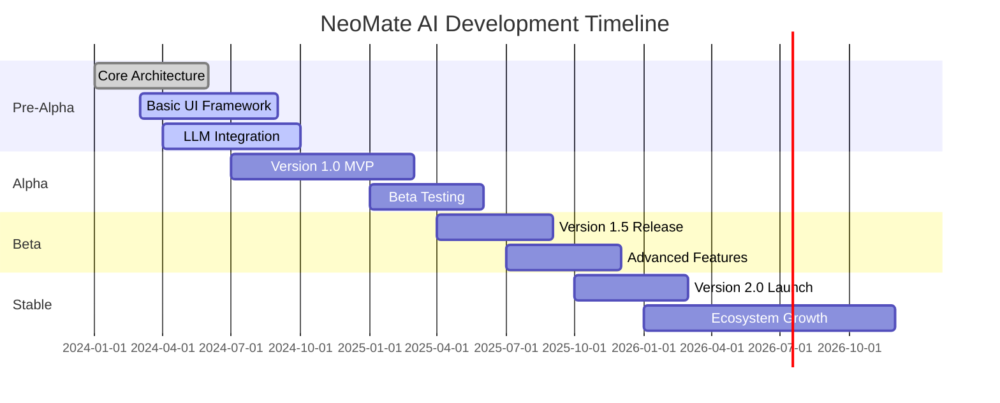

# NeoMate AI Development Roadmap 🗺️

> _Strategic development blueprint for NeoMate AI - Transforming human-computer interaction through autonomous intelligence_

**Status:** Active Development | **Version:** 0.1.0 (Pre-Alpha) | **Last Updated:** 2024-10-15

## 📋 Table of Contents

- 🌟 Overview
- 📊 Current Status & Metrics
- 📅 Development Timeline
- 🚀 Version 1.0: The Foundation
- 🤖 Version 1.5: The Specialist
- ✨ Version 2.0: The Companion
- 🚀 Future Visions (Post-2.0)
- 🤝 Contributing to the Roadmap
- 📈 Success Metrics & KPIs
- ⚠️ Risks & Mitigations

## 🌟 Overview

This comprehensive roadmap outlines our strategic vision for NeoMate AI's evolution from a basic AI assistant to a sophisticated, autonomous digital companion. Each milestone represents a significant leap in capabilities, user experience, and technological integration.

### 🎯 Core Principles

| Principle                   | Description                                        |
| --------------------------- | -------------------------------------------------- |
| **🔄 Incremental Progress** | Build solid foundations before advanced features   |
| **👥 Community-Driven**     | User feedback shapes development priorities        |
| **🤝 Open Collaboration**   | Transparent process with regular community updates |
| **✨ Quality First**        | Stable, well-tested releases over rapid deployment |
| **🔒 Privacy-Centric**      | User data protection and ethical AI practices      |

### 📈 Success Metrics

- **User Adoption**: Active users and engagement rates
- **Feature Utilization**: Most-used capabilities and workflows
- **Performance**: Response times, accuracy, and reliability
- **Community Growth**: Contributors, issues resolved, feature requests

## 📊 Current Status & Metrics

### Project Metrics

- **Version**: 0.1.0 (Pre-Alpha)
- **Development Stage**: Core Architecture
- **Active Contributors**: 1
- **Open Issues**: 0
- **Completed Features**: 15%
- **Test Coverage**: 0%

### Active Development Focus

- ✅ Core async architecture implementation
- 🔄 Basic UI framework setup
- 🔄 LLM integration testing
- 📋 Documentation and planning

### Next Major Milestone

**Version 1.0 MVP** - Q2 2025

- Core AI assistant functionality
- Voice and text interaction
- Basic automation capabilities

## 📅 Development Timeline

---

## 🚀 Version 1.0: The Foundation (Core Assistant)

_Target Release: Q2 2025_  
_Status: In Development_

The first major release focuses on establishing NeoMate AI as a functional AI assistant with core capabilities for voice interaction, basic automation, and intelligent task execution.

### Core Objectives

- Deliver a Minimum Viable Product (MVP) with essential AI assistant features
- Establish robust architecture for future enhancements
- Provide seamless user experience across different platforms

### Feature Checklist

#### 🧠 Core Engine

- [ ] Asyncio-based multi-tasking core system
- [ ] Modular architecture with clean separation of concerns
- [ ] Error handling and recovery mechanisms
- [ ] Performance optimization for real-time operation

#### 🎤 Sensory System

- [ ] Whisper.cpp integration for speech-to-text
- [ ] Piper TTS integration for text-to-speech
- [ ] Wake word detection and continuous listening
- [ ] Audio quality optimization and noise reduction

#### 👁️ Basic Vision

- [ ] Screen capture using mss and OpenCV
- [ ] OCR capabilities with Tesseract
- [ ] Basic object detection and recognition
- [ ] Screenshot analysis and interpretation

#### 🤖 Modular Brain

- [ ] Ollama integration for local LLM support
- [ ] OpenRouter integration for cloud LLM access
- [ ] Universal LLM API abstraction layer
- [ ] Context-aware conversation management

#### ⚙️ Basic Automation

- [ ] PyAutoGUI for mouse and keyboard control
- [ ] Basic system automation tasks
- [ ] Safe operation boundaries and permissions
- [ ] Undo/rollback functionality

#### 🗄️ Memory System

- [ ] SQLite-based local database
- [ ] Short-term and long-term memory management
- [ ] User preference learning and storage
- [ ] Conversation history and context retention

#### 🖥️ Initial UI

- [ ] PyQt6-based user interface
- [ ] Clean, intuitive design with accessibility features
- [ ] Status indicators and system monitoring
- [ ] Settings and configuration interface

---

## 🤖 Version 1.5: The Specialist (Advanced Skills & Learning)

_Target Release: Q4 2025_  
_Status: Planned_

This release transforms NeoMate from a basic assistant into a specialized AI with advanced learning capabilities and domain expertise.

### Core Objectives

- Implement self-improvement mechanisms
- Add specialized agents for different use cases
- Enhance automation with web and system integration
- Introduce ethical guidelines and safety measures

### Feature Checklist

#### 🧠 Self-Improvement

- [ ] Internet-based learning module
- [ ] Skill acquisition from user interactions
- [ ] Performance analytics and optimization
- [ ] Continuous model updates and improvements

#### 👥 Specialized Agents

- [ ] General-purpose agent for everyday tasks
- [ ] Real-time agent for immediate assistance
- [ ] Work agent for productivity and professional tasks
- [ ] Custom agent creation and management

#### 🌐 Advanced Web Automation

- [ ] Playwright integration for complex web tasks
- [ ] Browser automation and web scraping
- [ ] Form filling and multi-step web workflows
- [ ] Secure credential management

#### 🛡️ Ethical Compass

- [ ] Warning system for risky commands
- [ ] Privacy protection mechanisms
- [ ] Content filtering and safety checks
- [ ] User consent and permission management

#### 🗣️ Advanced NLP

- [ ] Sentiment analysis and emotional understanding
- [ ] Multi-language translation capabilities
- [ ] Contextual conversation flow
- [ ] Natural language understanding improvements

---

## ✨ Version 2.0: The Companion (Hyper-Personalization & Immersion)

_Target Release: Q2 2026_  
_Status: Vision_

The ultimate goal: Transform NeoMate into a true digital companion that anticipates needs, provides immersive experiences, and seamlessly integrates into daily life.

### Core Objectives

- Create deeply personalized user experiences
- Enable proactive assistance and anticipation
- Build extensible plugin ecosystem
- Achieve cross-device synchronization

### Feature Checklist

#### 🎭 Immersive UI

- [ ] Fully animated avatar system
- [ ] Dynamic UI/UX with fluid animations
- [ ] Voice visualization and emotional expressions
- [ ] Customizable appearance and themes

#### 🔮 Proactive Assistance

- [ ] Pattern recognition and habit learning
- [ ] Predictive task suggestions
- [ ] Automated routine management
- [ ] Context-aware notifications and reminders

#### 🔌 Plugin System

- [ ] Community plugin marketplace
- [ ] Secure plugin installation and management
- [ ] API for third-party integrations
- [ ] Plugin development framework and documentation

#### 📱 Cross-Device Sync (Optional)

- [ ] Multi-device preference synchronization
- [ ] Seamless experience across platforms
- [ ] Cloud backup with end-to-end encryption
- [ ] Offline-first architecture

#### 🎮 High-Performance Gaming Mode

- [ ] Optimized vision system for gaming
- [ ] Low-latency input processing
- [ ] Game-specific automation features
- [ ] Performance monitoring and optimization

---

## 🚀 Future Visions (Post-2.0)

### Version 3.0: The Collaborator

- Multi-user collaboration features
- Team productivity tools
- Enterprise integration capabilities
- Advanced security and compliance

### Version 4.0: The Innovator

- Custom AI model training
- Advanced research capabilities
- Global language support
- Quantum computing integration

---

## 📈 Success Metrics & KPIs

### Quantitative Metrics

- **User Engagement**: Daily/Weekly active users, session duration, feature usage frequency
- **Performance**: Response time (<500ms), accuracy rate (>95%), uptime (99.9%)
- **Growth**: Monthly active users, GitHub stars, community contributors
- **Quality**: Bug reports resolved, test coverage (>80%), user satisfaction scores

### Qualitative Metrics

- **User Feedback**: Net Promoter Score (NPS), feature request analysis, support ticket resolution
- **Community Health**: Contributor retention, issue response time, documentation completeness
- **Innovation**: New feature adoption rate, experimental feature success rate

### Milestone Success Criteria

#### Version 1.0 Success Criteria

- [ ] 100+ active beta users
- [ ] 95% task completion accuracy
- [ ] <2 second average response time
- [ ] Zero critical security vulnerabilities

#### Version 1.5 Success Criteria

- [ ] 500+ active users
- [ ] 50+ community plugins
- [ ] 99% uptime across all features
- [ ] Multi-language support for 5+ languages

#### Version 2.0 Success Criteria

- [ ] 1000+ active users
- [ ] 200+ community plugins
- [ ] Cross-device sync adoption >70%
- [ ] Proactive assistance accuracy >85%

## ⚠️ Risks & Mitigations

### Technical Risks

#### **High Complexity Integration**

- **Risk**: Complex integration of multiple AI models and frameworks
- **Impact**: Development delays, performance issues
- **Mitigation**: Modular architecture, extensive testing, phased integration
- **Contingency**: Fallback to simpler implementations

#### **Performance Bottlenecks**

- **Risk**: Real-time processing requirements exceed hardware capabilities
- **Impact**: Poor user experience, limited scalability
- **Mitigation**: Performance profiling, optimization techniques, hardware requirements documentation
- **Contingency**: Graceful degradation, cloud offloading options

#### **Security Vulnerabilities**

- **Risk**: AI system vulnerabilities or data breaches
- **Impact**: User trust loss, legal issues
- **Mitigation**: Security audits, encryption, access controls, regular updates
- **Contingency**: Immediate patching, transparent communication

### Business Risks

#### **Market Competition**

- **Risk**: Competing AI assistants capture market share
- **Impact**: Reduced adoption, funding challenges
- **Mitigation**: Unique value proposition, community engagement, continuous innovation
- **Contingency**: Pivot to niche markets, strategic partnerships

#### **Regulatory Changes**

- **Risk**: AI regulations impact development or deployment
- **Impact**: Compliance costs, feature limitations
- **Mitigation**: Legal consultation, compliance-first design, industry monitoring
- **Contingency**: Feature adjustments, regulatory engagement

#### **Funding Limitations**

- **Risk**: Insufficient resources for full development
- **Impact**: Scope reduction, timeline delays
- **Mitigation**: Diverse funding sources, MVP-first approach, community contributions
- **Contingency**: Open-source core, phased monetization

### Operational Risks

#### **Team Scalability**

- **Risk**: Difficulty attracting and retaining skilled contributors
- **Impact**: Development slowdown, quality issues
- **Mitigation**: Clear contribution guidelines, mentorship programs, competitive compensation
- **Contingency**: Contractor support, simplified architecture

#### **Community Management**

- **Risk**: Negative community feedback or toxic interactions
- **Impact**: Reputation damage, contributor loss
- **Mitigation**: Code of conduct, moderation, transparent communication
- **Contingency**: Community guidelines enforcement, focused engagement

---

## 🤝 How to Contribute to the Roadmap

We believe in community-driven development. Your input shapes the future of NeoMate AI!

### Ways to Get Involved

#### 💡 Suggest Features

- Open a [GitHub Issue](https://github.com/emonhmamun/NeoMate-AI/issues) with the "enhancement" label
- Describe your use case and why it would benefit the community
- Include mockups or examples if possible

#### 🗳️ Vote on Priorities

- Check existing issues and add your 👍 reaction to features you want
- Participate in [GitHub Discussions](https://github.com/emonhmamun/NeoMate-AI/discussions)
- Join our community surveys and polls

#### 🔧 Contribute Code

- Pick an item from the checklist above
- Follow our [Contributing Guidelines](docs/contributing.md)
- Submit a pull request with your implementation

#### 📊 Provide Feedback

- Test pre-release versions and share your experience
- Report bugs and suggest improvements
- Help translate and localize the application

### Roadmap Updates

This roadmap is reviewed and updated:

- **Monthly**: Minor adjustments and progress updates
- **Quarterly**: Major milestone reviews and reprioritization
- **Annually**: Long-term vision and strategic planning

---

**Help Shape the Future of NeoMate AI**

Your ideas and contributions drive our innovation. Let's build the ultimate AI companion together!

💡 Suggest a Feature • 🐛 Report an Issue • 💬 Join Discussions

